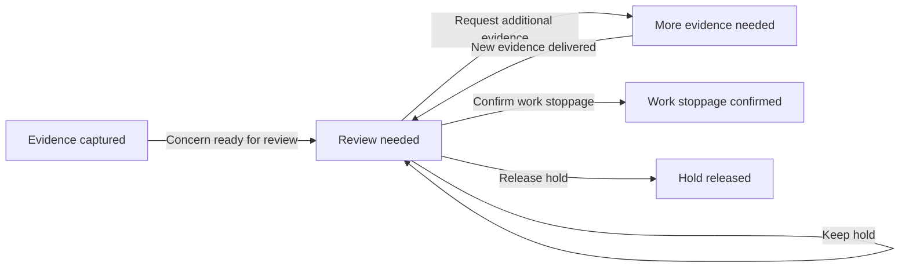

Public reading copy. Local paths generalized; original working document preserved.

# Phase-one terminology

Current V2 naming contract, September 14, 2026. Applies to landing, prototype, new V2 documentation, Figma and FigJam. It is a presentation of the selected review moments, not a complete production state machine.

## Five journey labels

| Canonical label | Meaning | Work and delivery implications |
| --- | --- | --- |
| **Evidence captured** | Photo saved; upload or AI analysis may still be pending. | No result is not clearance. Preserve any existing hold. Captured does not mean delivered. |
| **Review needed** | Evidence/concern awaits a human assessment or re-review. | Affected pole stays on hold. Other poles may be worked only under the independent-and-accessible assumption. |
| **More evidence needed** | Reviewer needs additional photos or observations. | Keep the affected pole on hold. Request recorded, sent and received are separate events. |
| **Work stoppage confirmed** | Authorized reviewer confirms work stoppage for the concern. | The affected pole remains stopped; record reviewer, reason and next procedure. Confirmation is not proof that reporting is complete. |
| **Hold released** | Authorized reviewer explicitly releases the hold with a reason. | Record the decision separately from delivery. The crew needs the applicable received instruction; a sent release must not silently display as received. |

Pending analysis is within **Evidence captured**; it is not a sixth headline state. Final outcomes branch. There is no automatic arrow from either outcome back to capture or review. Reopening requires an explicit new event outside this compact diagram.

## Three exact decision actions

- **Release hold**: reasoned, authorized release. It does not silently assert a verified species or completed reporting.
- **Keep hold**: retain the existing hold while review/procedure is unresolved. It does not mean confirmed work stoppage. May accompany an evidence request.
- **Confirm work stoppage**: record the reviewer’s confirmed stoppage decision, reason and next action. Different from merely leaving the existing hold in place.

**Request more photos** remains a supporting evidence action, not a fourth work decision. Reference/identification corrections do not trigger any of the three work actions automatically.

## Separate dimensions

- Review journey uses the five labels above.
- Work status describes hold, confirmed stoppage, or released hold for the identified pole.
- Delivery describes saved / pending upload / delivered and instruction recorded / sent / received. Do not relabel a delivery event as a review outcome.
- Species suggestion, reviewer identity assessment and nesting assessment remain independently revisable and attributed.

## Artifact alignment

Updated the live landing’s state diagram and evidence loop, plus active V2 plan action labels. Landing outcome branches show **Work stoppage confirmed** or **Hold released**, with the evidence loop **Review needed → More evidence needed → Review needed**.

Root/owning agents must apply exact action labels in prototype controls and accessible labels, diagram/Figma frames, and current handoff annotations. Existing asset screenshots need refresh after those UI changes; changing prose does not update raster images.

Historical QA reports, previous screenshots, comparative audit before/after descriptions and dated research notes preserve observed wording as historical evidence. Do not globally search-and-replace those records.

**Frozen-source exception:** the submitted two-page Part 1 PDF/Google Doc and the landing’s verbatim submitted question headings remain unchanged. Their original pause/report/release wording is source language, not a competing UI label. Current summaries can explain the new labels without retroactively rewriting the submission.
